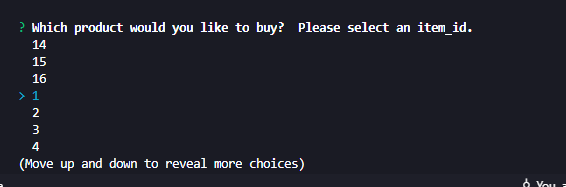

# BAMAZON Online Store!

### Welcome to the Bamazon Online store!
#### Here you'll see a table with the:
- **Item name & ID**
- **Price &**
- **Quantity available**

===============================================

## Once you've found an item, select its appropriate ID from the list!

===============================================

## After selecting the ID of your desired item, the application prompts you to purchase your desired quantity
### *After selecting your item you'll see the quantity of the items update after the purchase*

===============================================

#### *If you select an item with 0 stock you'll be prompted with a "Insufficient quantity!" message and then prompted with a re-order message*

===============================================

## Once your transaction is complete you'll then be prompted if you'd like to purchase anything else

#### **If no, then the app terminates the connection** 

===============================================

#### **If yes, the app reloads the table and ID select**            

===============================================
